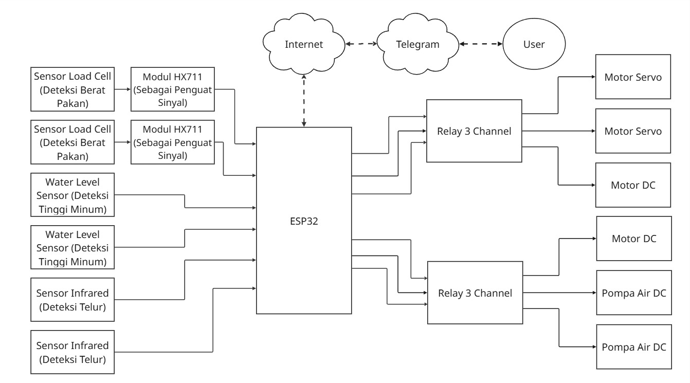
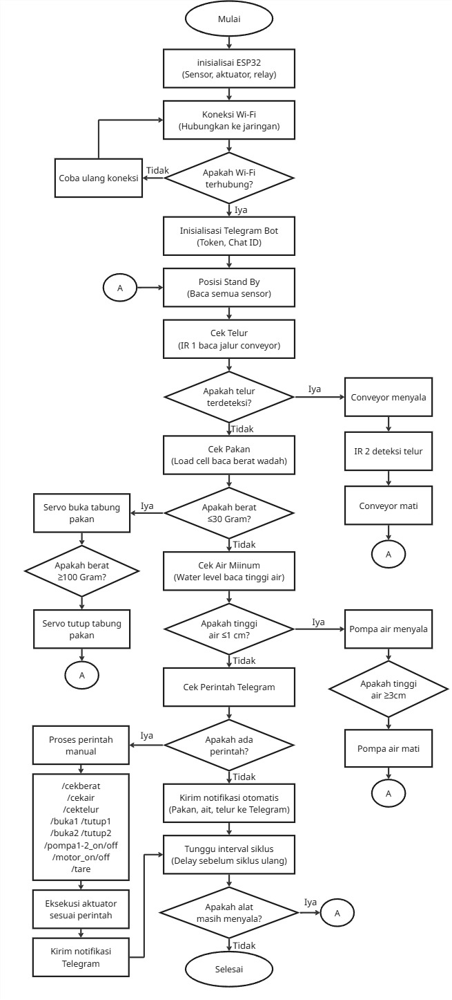
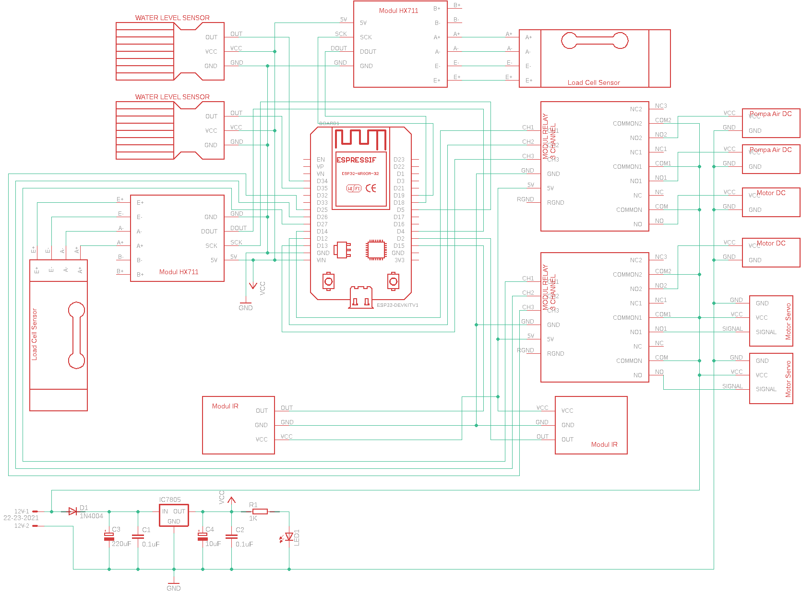
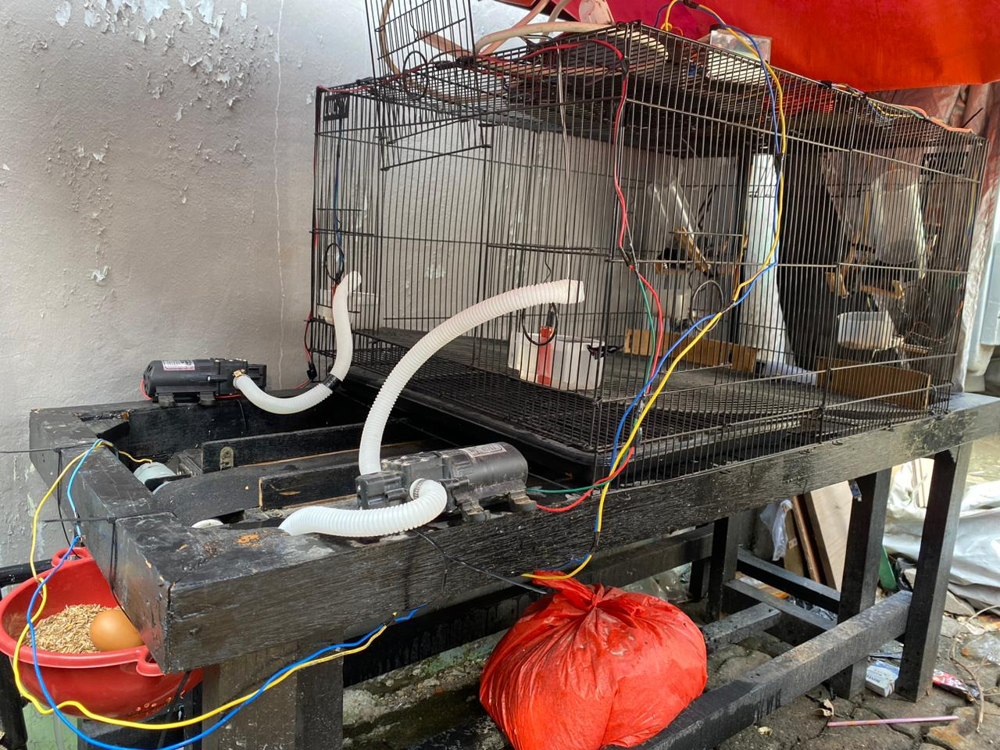
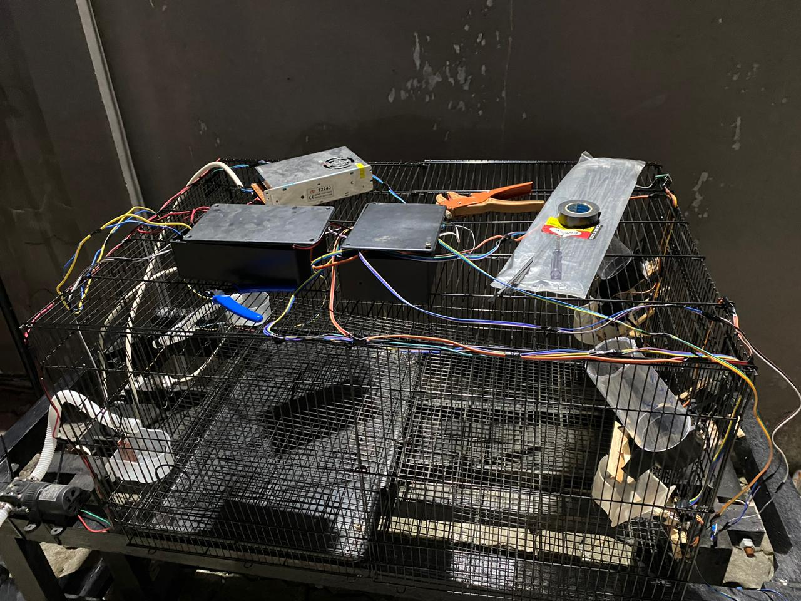
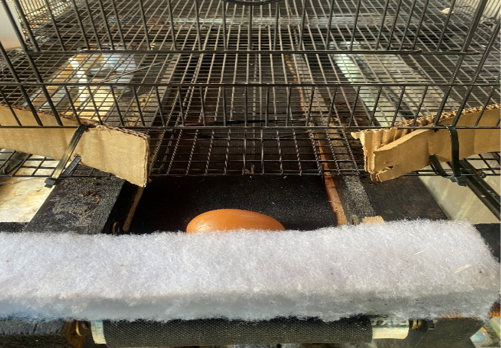

# Automatic Chicken Feeder & Egg Transfer System

ESP32-based IoT automation prototype for small-scale laying hen farms, integrating automatic feeding, drinking-water refill, egg transfer, and Telegram-based remote monitoring and control.

## Overview

This project is a prototype automation system designed to assist small-scale laying hen farmers by automating several routine activities.
The system uses an ESP32 as the main controller and integrates sensors, actuators, and IoT communication into a single system.

## Features

- Automatic feed monitoring and dispensing
- Automatic drinking-water refill
- Automatic egg transfer using a belt conveyor
- Infrared-based egg detection
- Telegram remote monitoring
- Telegram remote control
- Integrated operation of multiple subsystems

## Hardware

### Controller
- ESP32 DevKit V1

### Sensors
- Load Cell
- HX711
- Water Level Sensor
- Infrared Sensor

### Actuators
- Servo Motor
- DC Motor
- DC Water Pump
- Relay Module
- Belt Conveyor

### Power
- 12V DC power supply
- 5V DC voltage regulator

## Software

- Arduino IDE
- C/C++
- UniversalTelegramBot
- HX711 Library
- ESP32Servo

## System Architecture

  

## How It Works
1. The ESP32 initializes the sensors, actuators, and system components.
2. The system connects to a Wi-Fi network.
3. The Telegram Bot is initialized for remote communication.
4. The ESP32 continuously reads sensor conditions.
5. Feed, water, and egg-transfer functions are triggered according to predefined conditions.
6. Users can monitor system conditions and send manual commands through Telegram.
7. After each process, the system returns to standby and continues the operating cycle.

## Development Method
The prototype was developed using the V-Model, consisting of:
- Requirement Analysis
- System Design
- Architectural Design
- Module Design
- Coding
- Unit Testing
- Integration Testing
- System Testing
- Acceptance Testing

## Testing Results
- Maximum load cell error: 0.428%
- Intact egg transfer success rate: 80% (4 of 5 eggs)
- Telegram response time: 1–1.4 seconds
- Telegram commands tested: 14

## Limitations
The egg transfer mechanism still requires mechanical improvement. During testing, 4 of 5 eggs were successfully transferred in intact
condition, while 1 egg experienced minor cracking. The prototype was tested on a limited laboratory scale and is not yet intended to
represent a fully production-ready poultry automation system.

## Project Documentation
Additional documentation includes:
- System architecture
- Circuit and wiring diagrams
- Prototype photos
- Telegram interface
- Testing documentation

## Project Gallery
### System Architecture

  

### Flowchart

  

### Circuit Diagram

  

### Wiring Diagram

  

### Prototype

  

### Control Box

  

### Egg Transfer System

  

### Telegram Interface

  

